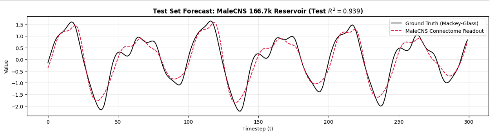
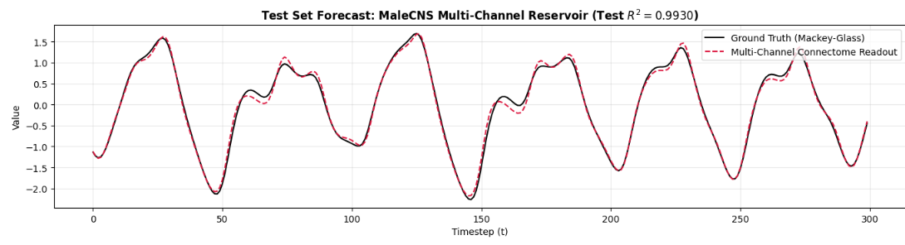
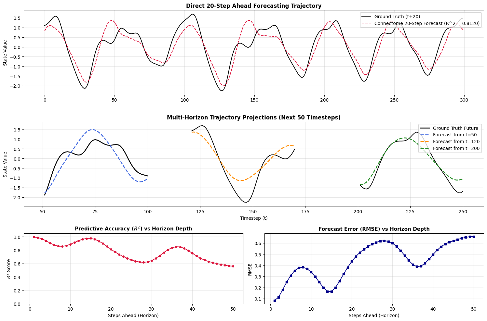
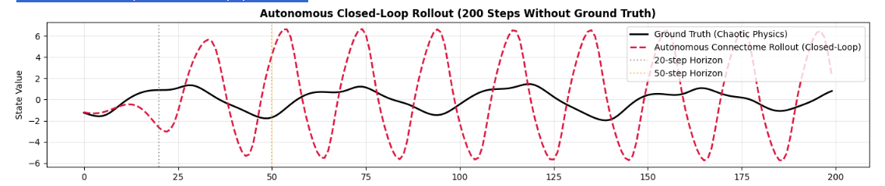
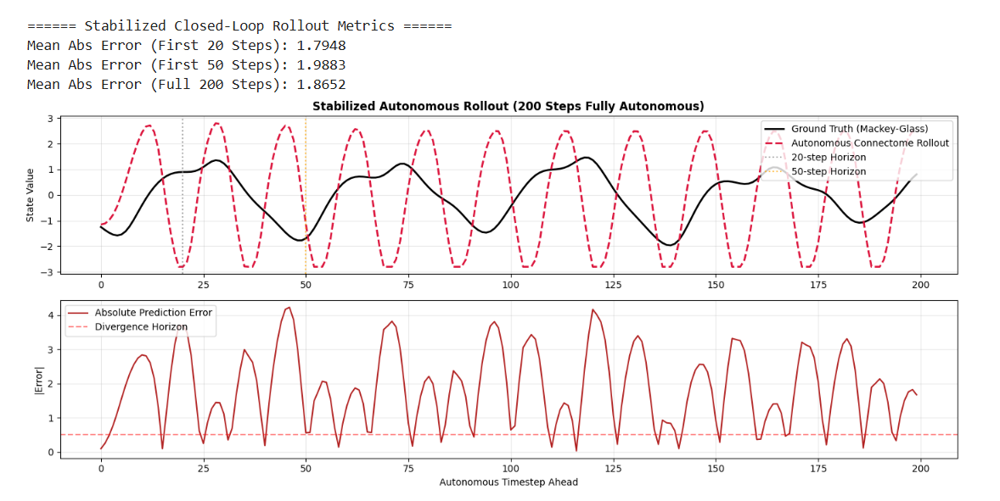

# MaleCNS Fly Brain: Multi-Channel Reservoir Computing (Liquid State Machine)

Turning a real biological brain into a chaotic time-series forecaster.

This project treats the connectome of the fruit fly (**MaleCNS v1.0** — 166,700 neurons, 88.3M sub-cellular nodes, ~151M synaptic connections) as the fixed recurrent weight matrix of a **reservoir computer** (a.k.a. an Echo State Network / Liquid State Machine). Instead of a randomly generated reservoir, the "brain" doing the computation is an actual, anatomically reconstructed nervous system, propagated on GPU as a sparse tensor. A small linear readout layer is trained on top of it to forecast a chaotic time series (Mackey-Glass), from 1 step ahead out to 50 steps ahead.

The core question: **how much predictive structure is already sitting inside real neural wiring, before any learning happens in the recurrent connections at all?**

---

## How it works

1. **Connectome graph → recurrent reservoir.** The MaleCNS synaptic connectivity graph (source neuron, target neuron, synapse weight) is loaded and converted into a sparse `torch.sparse_coo_tensor` recurrent weight matrix `W_res`, scaled to a target spectral radius. No connectome weights are trained — the biology stays fixed.

2. **Multi-channel sensory injection.** Rather than feeding the input signal into the network in one flat way, three anatomically distinct sub-populations of nodes are used as separate input channels:
   - **Channel 1 — Optic Lobe (visual):** raw signal `u(t)`
   - **Channel 2 — Antennal Lobe (olfactory):** temporal velocity `Δu(t) = u(t) − u(t−1)`
   - **Channel 3 — Central Complex (mechanosensory):** non-linear acceleration term `u(t)² · sign(u(t))`

   This gives the reservoir three complementary "views" of the driving signal, injected into three different neuropil regions, echoing how a real brain routes distinct sensory modalities into distinct anatomical regions.

3. **Reservoir dynamics.** State update is a standard leaky-integrator echo state network rule running on GPU:

   ```
   x(t) = (1 − α)·x(t−1) + α·tanh(W_res · x(t−1) + W_in · u(t))
   ```

   where `α` is the leak rate and `W_res` is the (spectral-radius-scaled) connectome adjacency.

4. **Linear readout.** 10,000–20,000 neural compartments are sampled from across the reservoir's ~88M nodes as features. A Ridge regression readout `W_out` is solved directly on GPU via the normal equations (`torch.linalg.solve`) — this is the only trained component in the whole system.

5. **Benchmark task.** The driving signal is the **Mackey-Glass** chaotic delay-differential system (`τ = 17`), a standard nonlinear/chaotic forecasting benchmark. The model is asked to predict the series at `t + h` for horizons `h = 1, 5, 10, 20, 50`.

---

## Results

### Single-channel connectome reservoir (166.7k neurons)

A single-channel baseline — raw signal only, no multi-sensory injection — already captures most of the short-term dynamics of the Mackey-Glass attractor.



**Test R² = 0.939**

### Multi-channel connectome reservoir (visual + olfactory + mechanosensory)

Splitting the input across three anatomically distinct channels and non-linear feature transforms (raw / velocity / acceleration) substantially tightens the fit over the single-channel baseline.



**Test R² = 0.993** (1-step-ahead)

### Multi-horizon direct forecasting

A separate readout is trained per horizon to directly predict `t + h` (rather than iterating a 1-step model), which avoids compounding one-step error but still has to face the fact that Mackey-Glass is chaotic — nearby trajectories diverge exponentially, so accuracy should decay as the horizon grows.

| Horizon (steps ahead) | R² | RMSE |
|---|---|---|
| 1  | 0.9933 | 0.0820 |
| 5  | 0.9053 | 0.3082 |
| 10 | 0.8857 | 0.3388 |
| 20 | 0.8120 | 0.4343 |
| 50 | 0.5601 | 0.6593 |



The top panel shows the direct 20-step-ahead forecast tracking the general shape and phase of the attractor across the whole test window. The bottom panels show the expected degradation curve: R² drops off (with a partial recovery around horizon ~35–40, likely an artifact of the specific phase of the oscillator at that offset) while RMSE trends upward as the horizon lengthens — the signature of a system trying to predict further into a chaotic trajectory whose sensitivity to initial conditions grows with `h`.

### Autonomous closed-loop rollout (no ground truth)

The more demanding test: after a short warm-up window driven by real data, ground truth is disconnected and the model's own 1-step predictions are fed back in as input, autonomously, for 200 steps.





```
Mean Abs Error (First 20 Steps): 1.7948
Mean Abs Error (First 50 Steps): 1.9883
Mean Abs Error (Full 200 Steps): 1.8652
```

**This is where the model breaks down**, and it's an important, honest result rather than a footnote: instead of continuing to track the irregular Mackey-Glass attractor, the closed-loop system collapses into a stable, regular limit-cycle oscillation with a much larger amplitude than the real signal. The divergence starts almost immediately after ground truth is removed (well before the 20-step horizon marker) and the prediction error stays well above the divergence threshold for the entire 200-step rollout.

This is a well-known failure mode for reservoir computers doing free-running (generative) chaotic reconstruction, not a bug specific to this connectome: a 1-step-ahead readout that is highly accurate when *driven* by real data can still fail to reproduce the true attractor once it has to generate its own inputs, because small errors compound multiplicatively under feedback and the readout was never trained to be stable under its own predictions. Reproducing a chaotic attractor autonomously (as opposed to forecasting a fixed horizon while driven) usually needs additional measures such as noise injection during training, teacher forcing schedules, spectral radius / leak-rate tuning tailored specifically for stability, or multi-step trained readouts — none of which were the focus of this pass.

---

## Interpretation

- **Fixed biological wiring is a surprisingly capable reservoir.** No connectome weight is trained, yet a linear readout on top of ~10–20k sampled compartments reaches R² > 0.99 for 1-step forecasting and stays above 0.8 out to a 20-step horizon on a chaotic benchmark.
- **Routing input through anatomically distinct channels helps.** The jump from R² = 0.939 (single raw-signal channel) to R² = 0.993 (three channels: raw / velocity / acceleration, injected into distinct neuropils) suggests that giving the reservoir richer, multi-modal views of the same signal — the way a real brain would receive it from different sensory organs — meaningfully improves the linearly-decodable information available to the readout.
- **Driven forecasting ≠ autonomous generation.** The model is a strong *driven* forecaster (fed real inputs, predicting ahead) but a weak *generative* model of the attractor (fed its own outputs). This gap is exactly the classic instability of feedback in reservoir computing, and is the main limitation to address in follow-up work.

---

## Pipeline / repo structure

The notebook (`malecns-reservoir-computing.ipynb`) runs end-to-end on a single NVIDIA Tesla T4 GPU:

1. **Environment setup** — Python 3.11 venv, PyTorch + CUDA 12.1, scientific stack.
2. **Data acquisition** — clones the connectome tooling repo, downloads and SHA-256-verifies the MaleCNS v1.0 dataset via a locked source manifest (`doom.connectome`, `doom.prepare`, `doom.audit_data`).
3. **`UltraFastMultiChannelReservoir`** — loads the connectome edge list (`.feather`/`.parquet`), builds the sparse GPU adjacency matrix, and exposes multi-channel input injection into visual / olfactory / mechanosensory node subsets.
4. **Benchmark generation** — synthetic Mackey-Glass chaotic series (`τ = 17`), normalized.
5. **Training** — reservoir forward pass over the driving series, GPU closed-form Ridge solve for the readout.
6. **Evaluation** — 1-step test performance, visualization of readout predictions, internal state trajectories, and reservoir activity heatmaps.
7. **`MultiHorizonMaleCNSReservoir`** — extends the pipeline to train and evaluate separate direct readouts per forecast horizon (1 / 5 / 10 / 20 / 50 steps).
8. **Autonomous rollout** — warm-up on real data followed by closed-loop, self-fed generation to test attractor reconstruction beyond driven forecasting.

## Requirements

- NVIDIA GPU (developed/tested on a Tesla T4) with CUDA 12.1
- Python 3.11
- PyTorch, NumPy, Pandas, scikit-learn, SciPy, Matplotlib, PyArrow/fastparquet
- MaleCNS v1.0 connectome data (fetched and checksum-verified automatically by the notebook)

## Possible next steps

- Train the readout with noise injection or multi-step rollout loss to improve autonomous stability.
- Sweep leak rate / spectral scaling specifically for generative (closed-loop) stability rather than just 1-step accuracy.
- Compare the biological connectome reservoir against random Erdős–Rényi or small-world reservoirs of matched size, to isolate how much of the performance is coming from the specific topology of a real brain versus reservoir size/sparsity alone.
- Test on additional chaotic benchmarks (Lorenz, Rössler) and on real sensory time series.

---

*Connectome data: MaleCNS v1.0. Benchmark task: Mackey-Glass chaotic time series (τ = 17). Compute: NVIDIA Tesla T4.*
